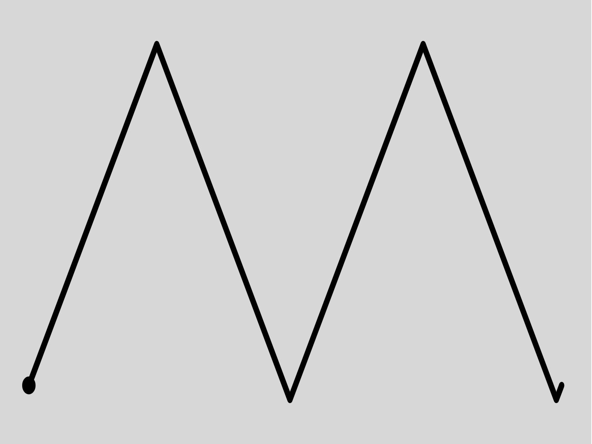

This project was bootstrapped with [Create React
App](https://github.com/facebook/create-react-app).

# Web Synth

I have always been fascinated by synthesisers; the sounds that they can make are
absolutely mesmirising, they have helped me learn a lot about what sound is
physically and mathemmatically and also given me motivation to learn about other
new concepts such as scale tunings etc. 

As a synthesiser enthusiast, I wish that I could have a synthesiser to play
with, but often the price is quite prohibitive. So I decided to build one
myself. I have used [Max](https://en.wikipedia.org/wiki/Max_(software)) to
fulfill this void in my soul before, however I was never able to share my
creations easily with anyone else. Perhaps someone didn't have the right
external libraries, or they didn't have max at all, and I felt as if I would
spend hours creating without any concrete goal in mind.

A while ago I heard about the [Web Audio
API](https://developer.mozilla.org/en-US/docs/Web/API/Web_Audio_API) and I
thought this would be a great opportunity. Everyone has a browser. So I set out
to reproduce one of my favourite synthesisers, (without ever seeing or playing a
real life version of it...) the [Korg
MS-20](https://en.wikipedia.org/wiki/Korg_MS-20). 

## Usage

### Modules

There are many modules and many knobs so it can be a little bit overwhelming
when you first try it out. Hopefully this can give you a better idea of what
happens.

#### Voltage Controlled Oscillator 1 and 2

There are two simillar looking modules labelled as Voltage Controlled
Oscillators. These are very important modules as they serve as a source of sound
to manipulate with the other modules.

##### Wave Form

Both oscillators have a wave form knob. This will change the shape of the wave
that they generate. There are different types of wave and they have different
characteristic sounds. Choosing the wave form is an important part when
constructing a sound.

| Wave Form | Shape | Sound |
|-|-|-|
| Sawtooth |  | The sawtooth has a rich signal, containing rich harmonics that are ripe for filtering. |
| Square / Pulse |  | The square wave also has a rich signal but it is quite different from the saw sound. |
| Triangle |  | The triangle wave, being closer to a sinusoid, is less rich harmonically than either saw or pulse wave forms. |
| Noise |  | [White noise](https://en.wikipedia.org/wiki/White_noise) is *harmonically* the richest signal (every frequency is equally represented), and can become very interesting with filtering. |

The wave form labeled ring on the second oscillator is the xor of the square
wave on the second oscillator and the pulse output of the first oscillator.

##### Pulse Width

The pulse width affects the duty cycle of the pulse output on the first
oscillator. Changing it can drastically affect the sound of both the pulse sound
and the ring modulator sound on the second oscillator.

##### Pitch

The pitch wheel on the second oscillator can be used to offset the pitch of the
second oscillator from the first and can create interesting harmony. For
example, the second oscillator could be set a perfect 5th above the first
oscillator, producing a familliar organ sound.

#### VCO Mixer

Both oscillators have separate gain knobs, so their volume can be modified
independently. 

#### Master Tune

Similar to the pitch knob on the second oscillator, this knob offsets the total
frequency, transposing the total signal.

#### Portamento

Increasing the portamento value puts a limit on how fast the frequency can
change. For eaxmple, with higher portamento time, making large interval jumps
will cause the frequency to ramp up like a siren.

#### Modulation Generator

The modulation generator is a low frequency oscillator that can affect the total
frequency going into the oscillators and the cutoff frequency of both filters.

It can be used to add a vibrato effect to the sound.

#### Filters

There are two filters, one is a lowpass and the other is a highpass. They bot
pass frequencies that are lower or higher respectively than a threshold (known
as the cutoff frequency) and limit frequencies that are outside this "pass
band". 

A high peak value will cause signal around the cutoff frequency to be boosted,
and can cause the filters to act as oscillators in their own right.

*The MS-20 is well known for its filters and their characteristic sound. It is
not the intention of this project to emulate this characteristic filter sound.*

#### Envelopes

There are two envelope modules that each affect different signals:

##### Envelope 1 (Delay, Attack, Release)

The first envelope is a delay/attack/release envelope and has three timing
values. When triggered the envelope will emit a ramp that starts at 0 following
these phases:

- **Delay**: The signal will be kept at 0 for a time until starting the attack
  phase.
- **Attack**: The signal will gradually increase to 1 and remain there until the
  trigger finishes before beginning the release phase.
- **Release**: The signal will gradually return to 0.

##### Envelope 2 (Hold, Attack, Decay, Sustain, Release)

The second envelope has more parameters and becomes more expressive. It affects
the output gain, and can affect the cutoff frequency of the filters. The value
it outputs is simmilar to envelope 1, but instead of staying at 1 after the
attack, it decays down to the sustain level before being released back to 0.

#### Keyboard

One of the most important parts is the keyboard! The keyboard emits a signal
representing the frequency of the note that was last pressed, and also emits
a trigger signal that conveys the current state of the keypress.

The keyboard can be controlled by the computer keyboard as well. The lowest note
being <kbd>z</kbd> and going up the scale to <kbd>,</kbd> before starting
another octave at <kbd>q</kbd>.